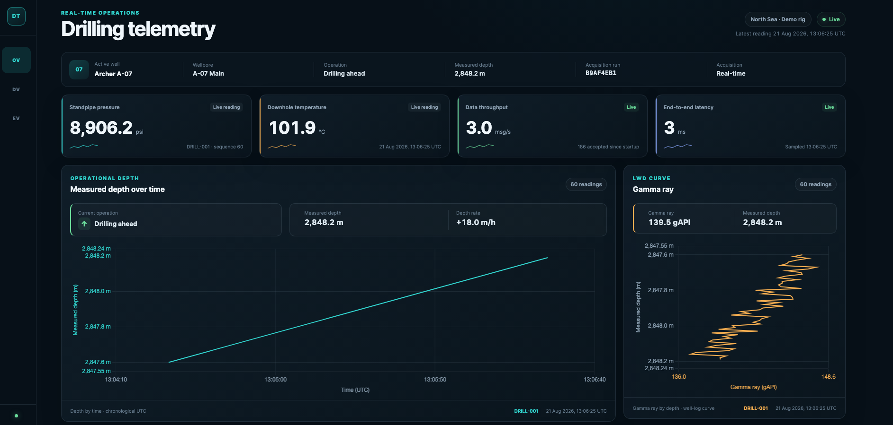
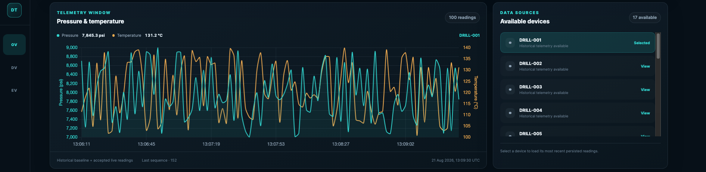
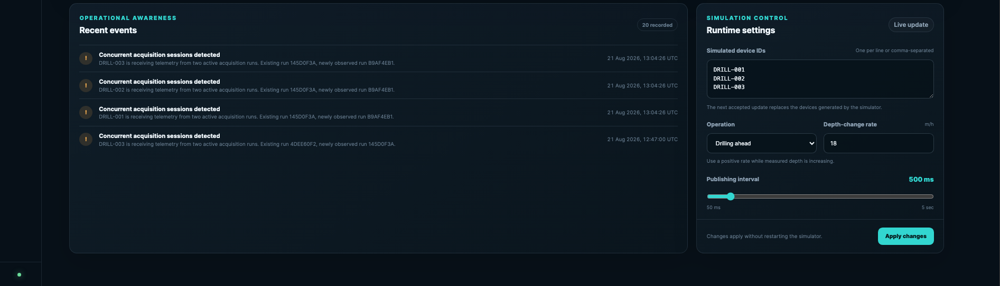
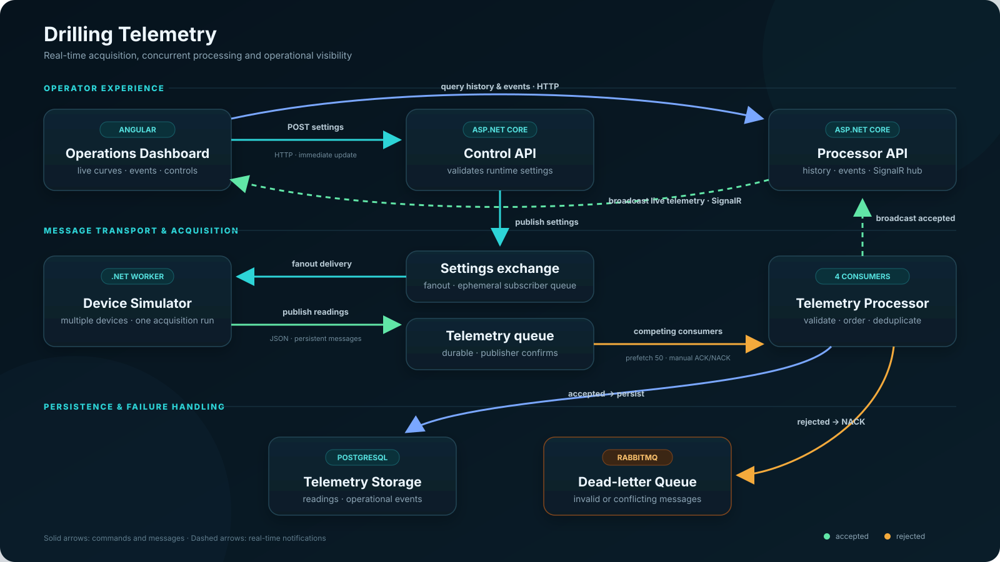

# Drilling Telemetry

Drilling Telemetry is a real-time data acquisition sample built with .NET, RabbitMQ, PostgreSQL, SignalR and Angular. It simulates drilling devices, processes telemetry concurrently and displays live operational data in a web dashboard.




*Figure 1 — Live drilling context and depth-indexed telemetry for the selected device.*

## Overview

The Device Simulator publishes synthetic telemetry readings to RabbitMQ. The Processor validates, partitions, persists and analyses those readings, then publishes accepted telemetry, operational events and process metrics through SignalR.

PostgreSQL stores telemetry readings and operational events. The Angular Dashboard reads history from the Processor API and receives live updates from SignalR. The Control API publishes simulation-setting commands through RabbitMQ so the simulator can change its devices, interval or drilling operation without restarting.

### Device telemetry

Persisted history is combined with accepted live readings for the selected device. The device list provides access to every source with stored telemetry.



*Figure 2 — Pressure and temperature history with live updates and per-device navigation.*

### Operational awareness and simulator controls

Processing anomalies are presented as operational events. The runtime settings panel controls the synthetic data source and is development tooling rather than a production equipment-management interface.



*Figure 3 — Concurrent acquisition warnings and runtime controls for the synthetic data source.*

## Architecture



The applications communicate through the existing RabbitMQ settings exchange and telemetry readings queue. The Processor uses PostgreSQL for durable state and its SignalR hub for live dashboard updates; rejected readings are routed to the dead-letter queue.

## Getting started

### Prerequisites

- .NET SDK `10.0.400` (`global.json`)
- Docker with Docker Compose
- Node.js `24.19.0` (`.nvmrc`)
- npm
- k6 (optional, for load and recovery tests)

### Environment

Create a local environment file from the supplied template:

```bash
cp .env.example .env
```

Open `.env` and replace the placeholder with a password for the local PostgreSQL instance:

```dotenv
Postgres__Password=choose-a-local-development-password
```

Docker Compose uses this value when it creates PostgreSQL. The Processor reads the same file when it runs in the `Development` environment, so no password needs to be repeated in `appsettings.json` or in the command line.

### Install dependencies

```bash
dotnet restore DrillingTelemetry.sln
npm --prefix src/DrillingTelemetry.Dashboard ci
```

### Start the applications

Start the applications in this order, using separate terminals from the repository root:

1. Infrastructure:

   ```bash
   docker compose up -d rabbitmq postgres
   ```

2. Processor:

   ```bash
   ASPNETCORE_ENVIRONMENT=Development \
   dotnet run \
     --project src/DrillingTelemetry.Processor/DrillingTelemetry.Processor.csproj \
     --urls http://localhost:5154
   ```

3. Device Simulator:

   ```bash
   dotnet run \
     --project src/DrillingTelemetry.DeviceSimulator/DrillingTelemetry.DeviceSimulator.csproj
   ```

4. Control API:

   ```bash
   ASPNETCORE_ENVIRONMENT=Development \
   dotnet run \
     --project src/DrillingTelemetry.Control.Api/DrillingTelemetry.Control.Api.csproj \
     --urls http://localhost:5153
   ```

5. Dashboard:

   ```bash
   npm --prefix src/DrillingTelemetry.Dashboard start
   ```

Open `http://localhost:4200` after the dashboard starts. RabbitMQ management is available at `http://localhost:15672` with the image's local default credentials, `guest` / `guest`.

Rider and WebStorm can also run the applications using their existing project configurations. The Processor's `http` launch profile already selects the `Development` environment and listens on port `5154`.

## Usage

### Update simulation settings

The Control API accepts a settings command and publishes it to the simulator without requiring a restart. `deviceIds` replaces the list of synthetic devices that generate telemetry; newly added devices appear in the dashboard after their first reading.

```bash
curl --request POST \
  --url http://localhost:5153/api/simulation/settings \
  --header 'Content-Type: application/json' \
  --data '{
    "deviceIds": [
      "DRILL-001",
      "DRILL-002",
      "DRILL-003"
    ],
    "publishingIntervalMilliseconds": 500,
    "drillingOperation": "DrillingAhead",
    "depthChangeRateMetresPerHour": 18
  }'
```

`drillingOperation` is serialised as `DrillingAhead`, `Stationary` or `TrippingOut`. The depth-change rate must match the operation: positive for `DrillingAhead`, zero for `Stationary` and negative for `TrippingOut`. A successful request returns `202 Accepted` with a revision, for example:

```json
{
  "revision": 2
}
```

### Read telemetry

List devices with persisted telemetry:

```bash
curl http://localhost:5154/api/telemetry/devices
```

Read up to 100 recent readings for a device:

```bash
curl "http://localhost:5154/api/telemetry/readings/DRILL-001?limit=100"
```

The history endpoint returns readings for the device's latest acquisition session, in chronological order. A shortened response example is:

```json
[
  {
    "deviceId": "DRILL-001",
    "acquisitionSessionId": "<runtime-generated-guid>",
    "sequenceNumber": 42,
    "wellId": "ARCHER-A-07",
    "wellName": "Archer A-07",
    "wellboreId": "ARCHER-A-07-MAIN",
    "wellboreName": "A-07 Main",
    "measuredDepthMetres": 2847.8,
    "drillingOperation": "DrillingAhead",
    "depthChangeRateMetresPerHour": 18,
    "pressurePsi": 8250,
    "temperatureCelsius": 117.5,
    "gammaRayApi": 67.2,
    "timestampUtc": "<runtime-timestamp>"
  }
]
```

The placeholders in this documentation represent values generated at runtime.

### Read operational events

```bash
curl "http://localhost:5154/api/telemetry/events?limit=20"
```

A shortened event response example is:

```json
[
  {
    "eventId": "<runtime-generated-guid>",
    "eventType": "SequenceGap",
    "severity": "Warning",
    "deviceId": "DRILL-001",
    "acquisitionSessionId": "<runtime-generated-guid>",
    "sequenceNumber": 42,
    "previousSequenceNumber": 40,
    "gapSize": 1,
    "message": "1 sequence position was skipped after 40.",
    "occurredAtUtc": "<runtime-timestamp>"
  }
]
```

Events are returned in reverse chronological order. They include duplicate, content-conflict, sequence-gap, out-of-order, invalid-message and concurrent-acquisition-session conditions.

### Import a WITSML 1.4.1.1 log

The WITSML importer is a standalone console application that reads a local WITSML 1.4.1.1 log XML file, converts its data rows to telemetry readings and publishes them to the same RabbitMQ queue consumed by the Processor. Imported readings appear in PostgreSQL and the dashboard through the existing pipeline.

```bash
dotnet run \
  --project src/DrillingTelemetry.WitsmlImporter/DrillingTelemetry.WitsmlImporter.csproj \
  -- \
  --file samples/witsml/real-time-drilling-log.xml \
  --device-id WITSML-DEMO-001
```

The importer supports a documented subset, not the full WITSML standard:

- WITSML version 1.4.1.1;
- a single `log` element with `indexType` set to `measured depth`;
- one `logData` block with simple comma-separated data lines (no escaped CSV fields);
- five required curves: `DEPT` (measured depth), `DTIM` (timestamp), `GR` (natural gamma ray), `SPP` (standpipe pressure) and `TEMP` (temperature).

Supported units:

| Curve | Accepted units | Conversion |
|---|---|---|
| `DEPT` | `m`, `ft` | `ft` converted to metres (0.3048) |
| `GR` | `gAPI` | No conversion |
| `SPP` | `psi` | No conversion |
| `TEMP` | `degC` | No conversion |
| `DTIM` | ISO 8601 with offset or `Z` | Normalised to UTC |

The importer does not implement SOAP, ETP, WebSocket or a WITSML server. It locates columns by the `mnemonicList` order (never assumes `logCurveInfo` order matches), rejects rows where a required curve is empty or uses its declared `nullValue`, and fails explicitly for unsupported units. A sample file is provided at `samples/witsml/real-time-drilling-log.xml`.

## Services and endpoints

| Service | Address | Purpose |
|---|---|---|
| Dashboard | `http://localhost:4200` | Live operational dashboard |
| Processor API | `http://localhost:5154` | Telemetry history and operational-event API |
| Processor Scalar | `http://localhost:5154/scalar/v1` | Development API documentation |
| Processor SignalR hub | `http://localhost:5154/hubs/telemetry` | Live readings, events and metrics |
| Control API | `http://localhost:5153` | Simulation-setting API |
| Control API Scalar | `http://localhost:5153/scalar/v1` | Development API documentation |
| RabbitMQ Management | `http://localhost:15672` | Local broker management |
| PostgreSQL | `localhost:5432` | `drilling_telemetry` database |

### HTTP endpoints

| Method | Route | Description | Expected status |
|---|---|---|---|
| `GET` | `/api/telemetry/devices` | Lists devices with persisted readings. | `200 OK` |
| `GET` | `/api/telemetry/readings/{deviceId}?limit=100` | Reads recent history for the latest acquisition session. | `200 OK`; `400` for invalid device or limit |
| `GET` | `/api/telemetry/events?limit=20` | Reads recent operational events. | `200 OK`; `400` for an invalid limit |
| `POST` | `/api/simulation/settings` | Publishes a validated simulation settings command. | `202 Accepted`; `400` for validation errors |

### SignalR events

The passive `TelemetryHub` is available at `/hubs/telemetry` and broadcasts:

| Event | Payload | Description |
|---|---|---|
| `telemetryReadingReceived` | `TelemetryReadingResponse` | Accepted reading that advances the live stream. |
| `operationalEventReceived` | `OperationalEventResponse` | Persisted operational event. |
| `telemetryMetricsUpdated` | `TelemetryMetricsResponse` | Processor-local throughput and latency metrics. |

## Reliability behaviour

- Readings use manual acknowledgement. The Processor acknowledges a delivery only after the normal processing path completes.
- RabbitMQ prefetch and processing partitions provide bounded in-flight work and concurrent processing of independent streams.
- Readings are partitioned by `DeviceId` and `AcquisitionSessionId`; each partition is processed sequentially.
- Telemetry is persisted before ACK, allowing RabbitMQ to redeliver work that was not acknowledged when the Processor stopped.
- PostgreSQL-backed idempotency uses `(DeviceId, AcquisitionSessionId, SequenceNumber)` as the natural key and compares the serialised payload.
- Identical duplicates are acknowledged and recorded without a second live broadcast.
- Conflicting content for an existing natural key is rejected and routed to the DLQ.
- Out-of-order readings are persisted but do not move the live state backwards.
- Sequence gaps are accepted, broadcast and recorded as operational events.
- Invalid readings and rejected conflicts are NACKed without requeue and reach the dead-letter queue.
- Concurrent acquisition sessions are reported as operational warnings without discarding otherwise valid telemetry.

A decrease in measured depth is valid during tripping out and is not treated as a sequencing error.

## Development

### Build

```bash
dotnet restore DrillingTelemetry.sln

dotnet build DrillingTelemetry.sln \
  --no-restore \
  -p:EnforceCodeStyleInBuild=true

npm --prefix src/DrillingTelemetry.Dashboard run build
```

### Tests

```bash
dotnet test DrillingTelemetry.sln \
  --no-build \
  --no-restore
```

The solution contains `DrillingTelemetry.DeviceSimulator.Tests` and `DrillingTelemetry.Processor.Tests`. No coverage percentage is published.

### Load and recovery tests

Run the Processor read API load test with k6:

```bash
k6 run tests/load/processor-read-api.js
```

The script exercises the device-list and telemetry-history endpoints. With no parameters, it targets the local Processor, requests the device list 10 times per second and requests 100 readings for `DRILL-001` 40 times per second for 30 seconds.

Configure the run by placing k6 environment variables before the command:

| Variable | Format | Default | Purpose |
| --- | --- | --- | --- |
| `PROCESSOR_BASE_URL` | Absolute HTTP URL without a trailing slash | `http://localhost:5154` | Processor API address |
| `DEVICE_ID` | Device identifier | `DRILL-001` | Device used by the telemetry-history requests |
| `DURATION` | k6 duration such as `30s`, `2m` or `1h` | `30s` | Duration of both request scenarios |
| `DEVICE_REQUESTS_PER_SECOND` | Positive integer | `10` | Device-list requests started per second |
| `READING_REQUESTS_PER_SECOND` | Positive integer | `40` | Telemetry-history requests started per second |
| `READING_LIMIT` | Positive integer | `100` | Maximum readings requested per history response |

For example, run a two-minute test against the local Processor with 50 total requests per second:

```bash
PROCESSOR_BASE_URL=http://localhost:5154 \
DEVICE_ID=DRILL-001 \
DURATION=2m \
DEVICE_REQUESTS_PER_SECOND=10 \
READING_REQUESTS_PER_SECOND=40 \
READING_LIMIT=100 \
k6 run tests/load/processor-read-api.js
```

The request rates are independent: the example produces 10 device-list requests and 40 telemetry-history requests per second. Invalid non-integer or non-positive rate and limit values stop the test before it starts.

Run the Processor outage and recovery scenario:

```bash
./tests/load/run-processor-recovery.sh
```

The recovery script starts the infrastructure and applications, creates a telemetry backlog during a Processor outage, restarts the Processor, runs the read API load profile and captures queue/database evidence under `artifacts/recovery-tests/`.

## Project structure

```text
src/
├── DrillingTelemetry.Contracts/
├── DrillingTelemetry.Control.Api/
├── DrillingTelemetry.DeviceSimulator/
├── DrillingTelemetry.Processor/
├── DrillingTelemetry.WitsmlImporter/
└── DrillingTelemetry.Dashboard/

tests/
├── DrillingTelemetry.DeviceSimulator.Tests/
├── DrillingTelemetry.Processor.Tests/
├── DrillingTelemetry.WitsmlImporter.Tests/
└── load/

samples/
└── witsml/

database/
├── init.sql
└── migrations
```

- `Contracts` contains shared message and domain contracts.
- `Control.Api` publishes simulation-setting commands.
- `DeviceSimulator` produces telemetry readings.
- `Processor` handles validation, persistence, ordering, idempotency, events and SignalR.
- `WitsmlImporter` converts a WITSML 1.4.1.1 log file into telemetry readings and publishes them to RabbitMQ.
- `Dashboard` presents history and live data.
- `tests` contains .NET tests, the k6 read test and recovery tooling.
- `samples` contains the example WITSML log file.
- `database` contains the fresh-install schema and incremental migrations.

## Scope

This repository is a focused drilling telemetry sample, not a production acquisition platform. The WITSML importer covers a small 1.4.1.1 measured-depth subset (no SOAP, ETP, trajectory surveys or full standard support). Other exclusions include production authentication or authorisation, automatic producer failover, leader election and distributed acquisition-conflict coordination. Metrics and concurrent-session detection are process-local, and gamma ray data is synthetic rather than a geological model.
